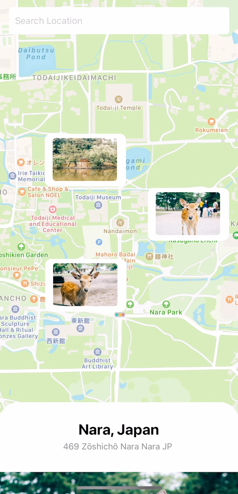

# ustHack21

## Description
Nowadays, people tend to travel by themselves rather than travel agency as most of the information could be found online. A lot of videos would be shown if you search about the name of the location on YouTube. However, most of the tourism vlogs only talk about the attraction views but not the actual environment. Therefore, we developed a social media for users to exchange and share the details of their trip.

A picture is required for users to share regarding the trip, the picture would be uploaded based on their current location as a "marker" which the other users can see when they scroll to the corresponding place. An algorithm is used to combine the surroundings within 0.5km into the same spot to prevent overcrowding. "Markers" are shown on the map in their corresponding location. For the places with many "markers", only a few pictures with the highest likes would be shown on the map to avoid affecting user experience, and customers could click to look more if they are interested in the place. Also, it is difficult for us to gather sufficient pictures at the early stage due to the low exposure of the application. Hence, we have made use of the google map street view API for the spot without any markers, which users can still explore the place. Users can add different attraction points in their trip package for planning the travel trip, a suggested route would be generated based on the spot after they planned the package.

Besides, the application has a random location button for the user who wants to explore the world. The system would generate a random location that can let users know better about the different places. Furthermore, one of key features in social media application is to allow user to share their daily life with their friends, and user can share their experience with their friends privately via the chatroom.

For the technical side, we utilize DynamoDB, one of the NoSQL database providers to gather user’s data as pictures are unstructured data. NoSQL database is able to store a huge amount of data which is significant for a social media app. Also, serverless arthriticture is applied.

This project is use the React native to build up and build the serverless Architecture in AWS cloud. people tend to travel by themselves rather than travel agency as most of the information could be found online. Therefore, we developed a social media for users to exchange and share the details of their trip.

### Members
- HUNG Ho Hin
- KWOK, Ho Hin
- LAM, Chun Hin
- CHAN, Kwun Lam)

### Demonstration
If you interesting this project, you can view my demo video in Youtube
[Youtube video Click Here](https://youtu.be/wNURgAZhl84)

